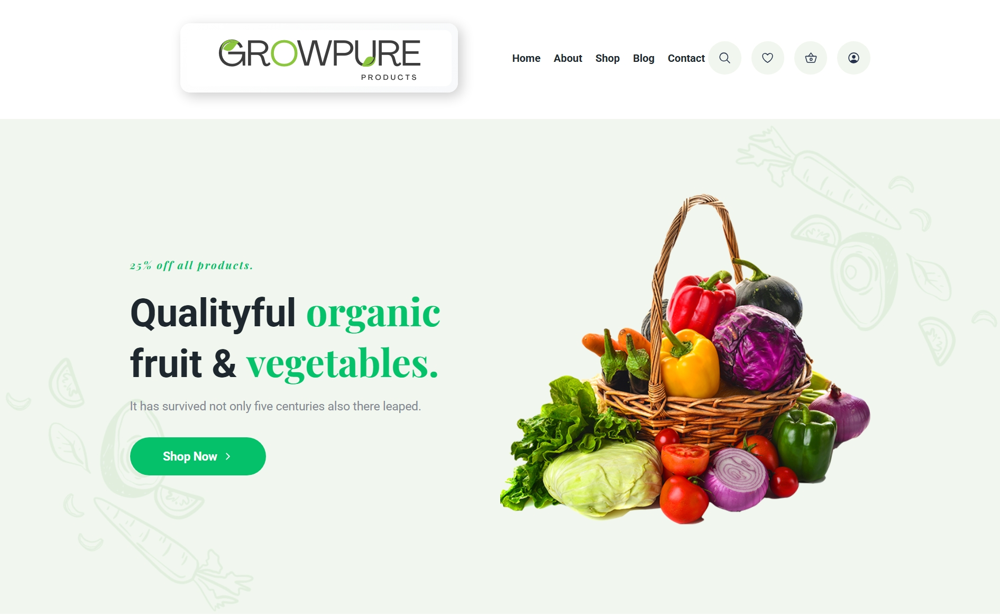
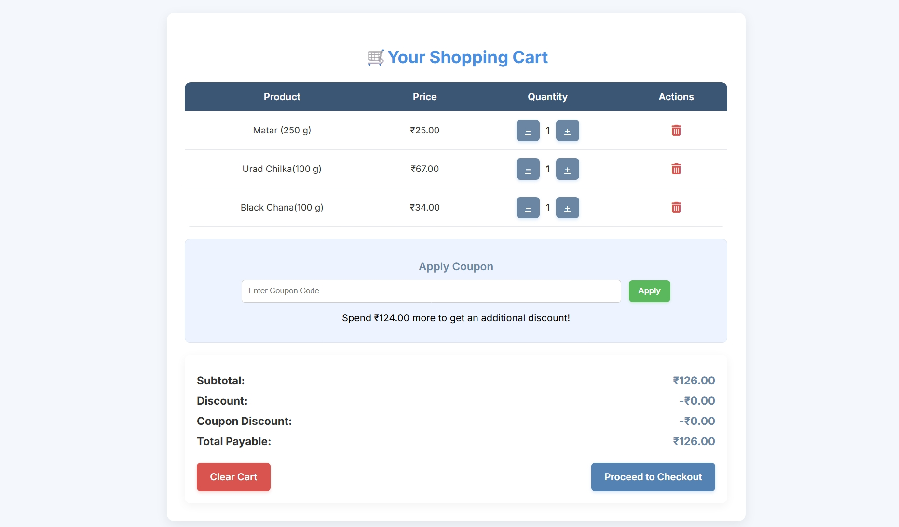
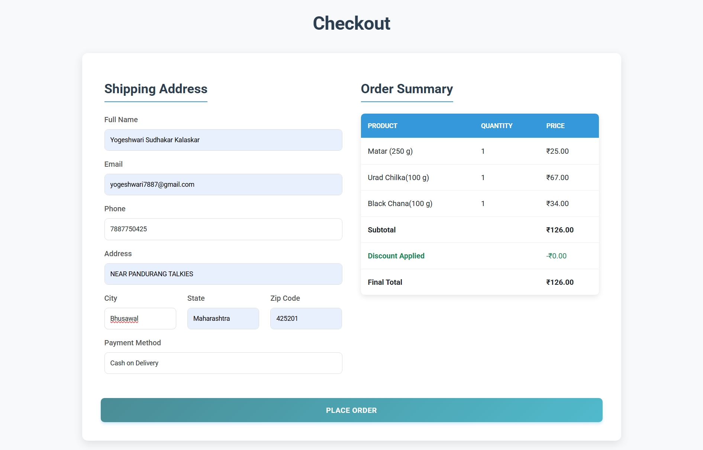
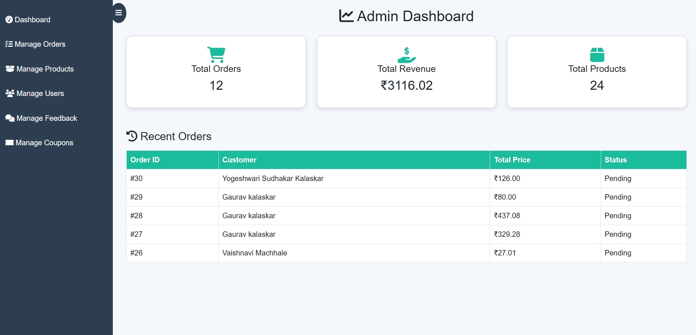

# GrowPure 🌱

GrowPure is a **Django-based eCommerce website** for organic vegetables, fruits, and grains.  
It connects farmers with consumers by providing a transparent and reliable platform.

---

## 🚀 Features
- 🛒 Shopping Cart with coupons & discounts  
- 📦 Checkout system with progress indicator  
- 👤 User Dashboard (profile, order tracking, wishlist, reorders)  
- 🛠️ Admin Dashboard for managing products & orders  
- 📰 Blog Page for organic farming awareness  

---

## 🛠️ Tech Stack
- **Frontend:** HTML, CSS, JavaScript, Bootstrap  
- **Backend:** Django (Python)  
- **Database:** SQLite (can be upgraded to PostgreSQL/MySQL)  
- **Version Control:** Git & GitHub  

---

## 📸 Screenshots

### 🏠 Home Page


### 🛍️ Products Page


### 🛒 Cart Page


### 💳 Checkout Page


### 🛠️ Admin Dashboard


### 📰 Blog Page


---

## ⚙️ How to Run the Project
1. Clone the repository  
   ```bash
   git clone https://github.com/your-username/GrowPure.git
   cd GrowPure
